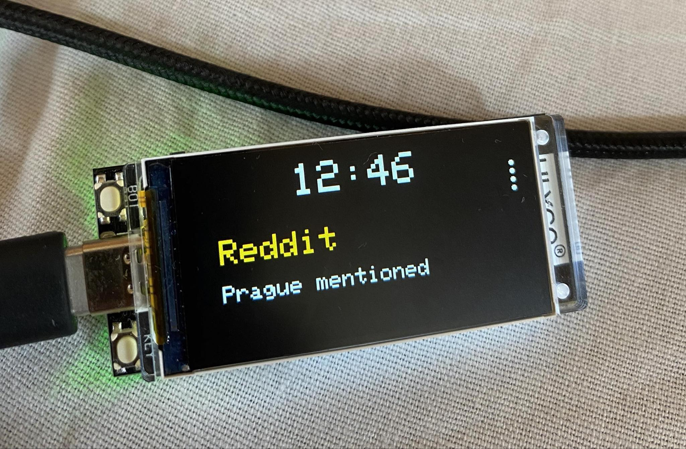

# Lilygo-t-displays3-BLE-ANCS-server

This is ESP32-S3 based BLE ANCS server. Build it with PlatformIO and upload to board, then you can connect to it with your phone and receive notifications from it. Code is based on https://github.com/gabrielchristino/ANCS.

## Tested hardware

- LILYGO® T-Display-S3 ESP32-S3 1.9 inch ST7789 LCD 
- Iphone 11, iOS 17.5.1

